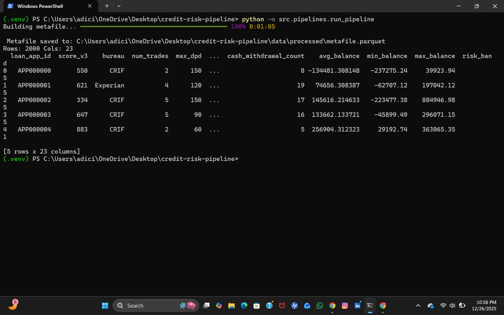
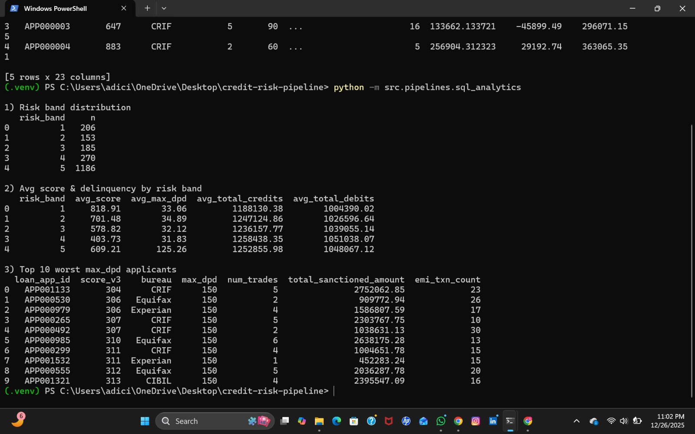

# Credit Risk Metafile Pipeline (Fintech-Style Data Engineering)

An end-to-end **credit risk data pipeline** inspired by how fintech/NBFC teams build underwriting datasets (“**metafiles**”) from **credit bureau** + **bank statement** data.

This project simulates two common upstream sources:
- **Credit bureau report JSON** (score, trades, delinquency/DPD)
- **Banking transactions JSON** (credits, debits, salary, EMI, balances)

…and produces a single **Parquet metafile** (1 row per applicant) that can be queried using **SQL (DuckDB)** for risk analytics.

**Why this matters:**  
This project mirrors how real NBFC and fintech underwriting teams consolidate fragmented credit bureau and banking transaction data into a single, analytics-ready decisioning dataset.

---
## Pipeline Execution & Analytics

### End-to-End Pipeline Run
This shows the successful execution of the full credit risk data pipeline, generating an analytics-ready metafile.



---

### Risk Analytics & Credit Insights
This shows downstream analytics derived from the metafile, including:
- Risk band distribution
- Average credit score vs delinquency
- Top high-risk applicants



---

## What this project does

### 1) Generate synthetic raw data (data lake style)
Creates raw JSON files for:
- `data/raw/bureau/APPxxxxxx.json`
- `data/raw/banking/APPxxxxxx.json`

### 2) Parse raw JSON into clean tables
- Bureau: **1 row per trade**
- Banking: **1 row per transaction**

### 3) Feature engineering (metafile)
Builds applicant-level features such as:
- Bureau: `num_trades`, `max_dpd`, `avg_dpd`, `total_sanctioned_amount`, delinquency flags (`dpd_30_plus`, `dpd_60_plus`, `dpd_90_plus`)
- Banking: `total_credits`, `total_debits`, `salary_credits_count`, `emi_txn_count`, `cash_withdrawal_count`, `avg_balance`, `min_balance`, `max_balance`
- Risk segmentation: `risk_band` (1 = lowest risk, 5 = highest risk) using a simple rule-based policy

### 4) Save outputs in Parquet
- `data/processed/metafile.parquet` (applicant-level dataset)

### 5) Run SQL analytics on Parquet (DuckDB)
Examples include:
- risk band distribution
- avg score/delinquency by band
- top delinquent applicants

---

## Tech Stack

- **Python 3.13**
- **Pandas** (feature engineering)
- **DuckDB** (SQL analytics on Parquet)
- **PyArrow** (Parquet)
- **Rich** (progress bar)

---

## Project Structure

```text
credit-risk-pipeline/
  data/
    raw/
      bureau/        # raw bureau JSON per applicant
      banking/       # raw banking JSON per applicant
    processed/
      metafile.parquet
  src/
    parsers/
      bureau_parser.py
      banking_parser.py
    features/
      feature_engineering.py
    pipelines/
      generate_synthetic_data.py
      run_pipeline.py
      sql_analytics.py
    scoring/
      score_model.py
    utils/
      io.py
